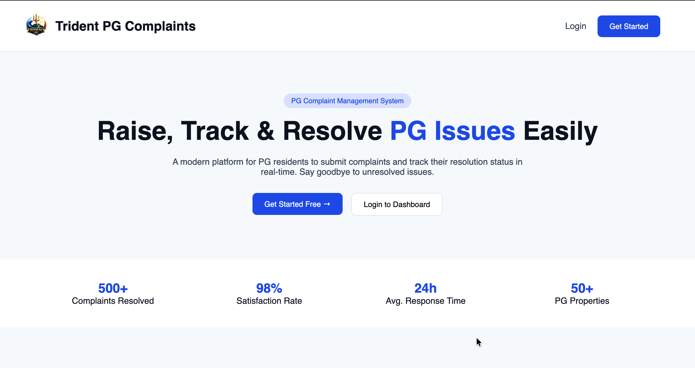
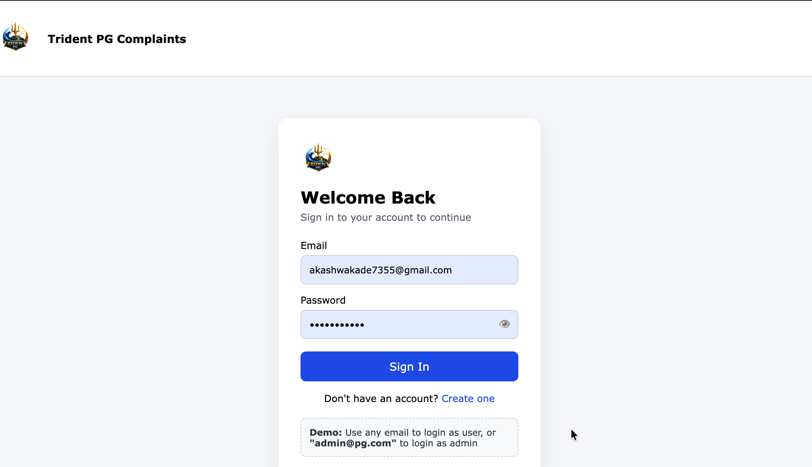
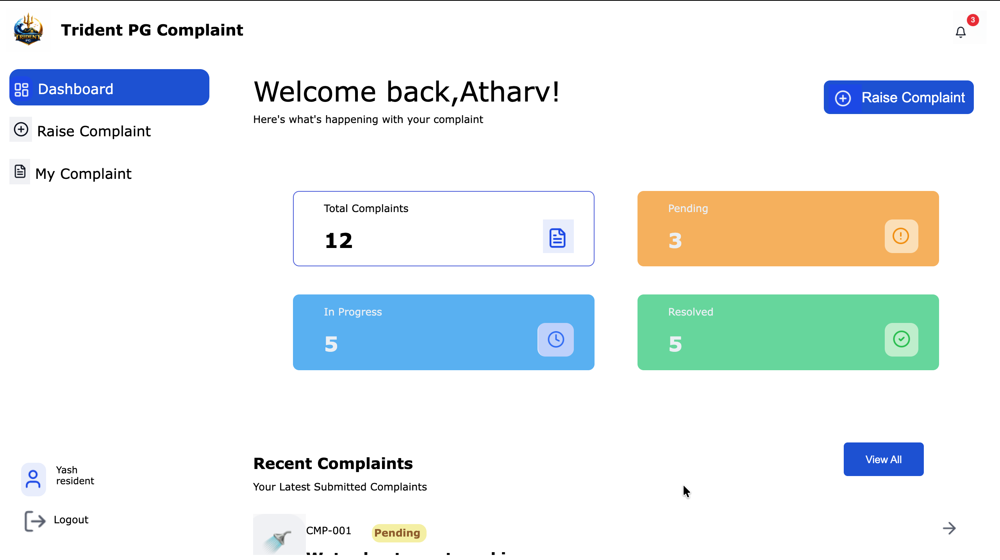
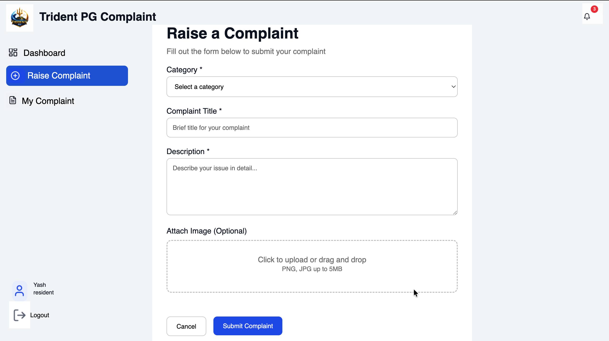
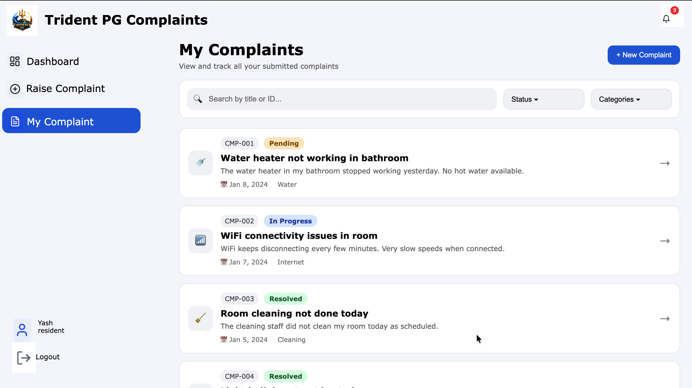

<p align="center">
  
</p>

<p align="center">
  <b>A Modern Complaint Management Platform for PG Residents</b>
</p>

---

<p align="center">


</p>

---

# 🚀 Trident PG Complaint Management System

A **modern, fast, and intuitive Complaint Management System** built to simplify how PG residents report issues and how management tracks and resolves them.

Designed with a strong focus on **user experience, structured architecture, and professional UI**, this project reflects real-world product design principles.

> 💡 **Goal:** Eliminate unresolved complaints and improve resident satisfaction through transparency and tracking.

---

# 🌟 Why This Project Stands Out

Unlike basic academic projects, this system is designed like a **real SaaS product interface**.

✅ Professional Dashboard  
✅ Structured Multi-Page Architecture  
✅ Modular Codebase  
✅ Scalable Folder Design  
✅ Clean UI Components  
✅ Realistic Complaint Workflow  
✅ Recruiter-Friendly Project Depth

---

# 🖥️ Live Preview

### 👉 **https://complaint-management-system-17w1.vercel.app/**

## 🏠 Landing Experience

<p align="center">
  
</p>

---

## 🔐 Secure Login

<p align="center">
  
</p>

---

## 📊 Smart Resident Dashboard

<p align="center">
  
</p>

---

## 📝 Raise Complaints Effortlessly

<p align="center">
  
</p>

---

## 📌 Track Every Complaint

<p align="center">
  
</p>

---

# 🧠 System Capabilities

### 👤 Resident Features

✔ Create Account  
✔ Secure Login  
✔ Raise Complaints  
✔ Attach Issue Details  
✔ Track Status  
✔ View Complaint History

---

### 🛠️ Complaint Lifecycle

```
Pending → In Progress → Resolved
```

Built to mirror real-world ticketing workflows.

---

# 📂 Project Structure

```
Complaint-Management-System/
│
├── index.html
│
├── src/
│   ├── style.css
│   ├── script.js
│
│   ├── login-page.html
│   ├── login-page.css
│   ├── login-page.js
│
│   ├── create-account.html
│   ├── create-account.css
│   ├── create-account.js
│
│   ├── main-interface.html
│   ├── main-interface.css
│
│   ├── my-complaints.html
│   ├── my-complaints.css
│   ├── my-complaints.js
│
│   ├── query-form.html
│   ├── query-form.css
│   ├── query-form.js
│
│   ├── complaint-1.html
│   ├── complaint-1.css
│   ├── complaint-2.html
│   ├── complaint-2.css
│   ├── complaint-3.html
│   ├── complaint-3.css
│   ├── complaint-4.html
│   ├── complaint-4.css
│   ├── complaint-5.html
│   ├── complaint-5.css
│   ├── complaint-6.html
│   ├── complaint-6.css
│
├── images/
│   ├── dashboard-blue-img.png
│   ├── dashboard-img.png
│   ├── In-progress-2-img.png
│   ├── In-progress-img.png
│   ├── Left-head-arrow.png
│   ├── my-complaint-blue-img.png
│   ├── my-complaints-img.png
│   ├── notification-img.png
│   ├── pending-2-img.png
│   ├── pending-img.png
│   ├── pg-logo.png
│   ├── raise-complaint.png
│   ├── raise-complaint-blue.png
│   ├── resident.png
│   ├── resolved-2-img.png
│   ├── resolved.png
│   ├── preview-1.png
│   ├── preview-2.png
│   ├── preview-3.png
│   ├── preview-4.png
│   └── preview-5.png
```

---

# ⚙️ Tech Stack

| Technology            | Role                 |
| --------------------- | -------------------- |
| **HTML5**             | Semantic Structure   |
| **CSS3**              | Modern UI Styling    |
| **JavaScript**        | Dynamic Behavior     |
| **Responsive Design** | Multi-Device Support |

---

# 🚀 Run Locally

```bash
git clone https://github.com/your-username/complaint-management-system.git

cd complaint-management-system

open index.html
```

---

# 🧭 Future Roadmap

✅ Admin Panel  
✅ Backend Integration (Node / Firebase)  
✅ Authentication  
✅ Email Alerts  
✅ Complaint Analytics  
✅ Role-Based Access  
✅ Dark Mode  
✅ Mobile App Version

---

# 🤝 Contributing

Contributions elevate projects from good → great.

```
Fork → Improve → Pull Request
```

All ideas are welcome!

---

# ⭐ Show Your Support

If this project helped you or inspired you:

👉 Drop a ⭐ on the repository.

It genuinely motivates further development.

---

# 👨‍💻 Authors

## Akash

**Project Lead & Developer**

## Shruti

**Frontend Contributor**

## Anhadh

**UI/UX Contributor**

## Aparna

**Testing & Feedback**

## Amrita

**Documentation Support**
